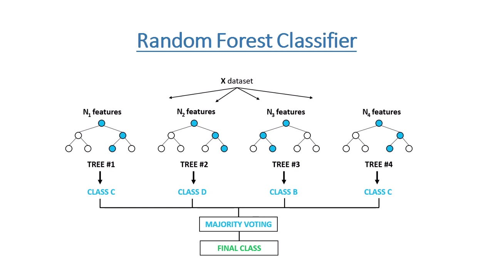
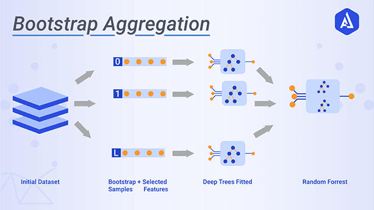

[toc]

# Random Forest and effect of Hyperparameters on result

| Tên thành viên    | MSSV     |
| ----------------- | -------- |
| Văn Viết Hiếu Anh | 19521225 |
| Văn Viết Nhật     | 19521958 |
| Lê Văn Phước      | 19522054 |

# Giới thiệu về Random Forest Classifier

Random Forest Classifier là mô hình sử dụng để giải quyết bài toán classification. Nó sử dụng thuật toán Random forest, đây là thuật toán supervised learning trong máy học được sử dụng trong cả bài toán regression và classification.



## Giới thiệu về thuật toán Random Forest

Random là ngẫu nhiên, Forest là rừng, nên ở thuật toán Random Forest sẽ xây dựng từ nhiều cây quyết định bằng thuật toán Decision Tree, tuy nhiên mỗi cây quyết định sẽ khác nhau (có yếu tố random). Sau đó kết quả dự đoán được tổng hợp từ các cây quyết định.
Đối với bài toán này thì đầu ra của thuật toán Random Forest là loại được chọn bởi hầu hết các cây.

Về mặt kỹ thuật, thuật toán Random Forest là một phương pháp tổng hợp (dựa trên cách tiếp cận chia để trị) của các cây quyết định được tạo trên một tập dữ liệu được phân chia ngẫu nhiên. Tập hợp các bộ phân loại cây quyết định này còn được gọi là rừng. Các cây quyết định riêng lẻ được tạo bằng cách sử dụng một chỉ báo lựa chọn thuộc tính như mức tăng thông tin, tỷ lệ tăng cho mỗi thuộc tính. Mỗi cây phụ thuộc vào một mẫu ngẫu nhiên độc lập. Trong một bài toán phân loại, mỗi cây bình chọn và lớp phổ biến nhất được chọn làm kết quả cuối cùng. Nó đơn giản hơn và mạnh mẽ hơn so với các thuật toán phân loại phi tuyến tính khác.

## Thuật toán

### Decision Tree Learning

Decision Tree là một phương pháp phổ biến cho các tác vụ học máy khác nhau. Đặc biệt, những cây được trồng rất sâu có xu hướng học các kiểu hình bất thường cao, chúng trang bị quá nhiều bộ huấn luyện của mình, tức là có độ lệch thấp, nhưng phương sai rất cao. Random Forest là một cách lấy trung bình nhiều cây quyết định sâu, được huấn luyện trên các phần khác nhau của cùng một tập huấn luyện, với mục tiêu giảm phương sai. Điều này phải trả giá bằng một sự gia tăng nhỏ trong độ chệch và một số mất khả năng diễn giải, nhưng nói chung là tăng đáng kể hiệu suất trong mô hình cuối cùng.

Forest giống như sự kết hợp của các nỗ lực thuật toán Decision Tree. Thực hiện việc làm việc theo nhóm của nhiều cây do đó cải thiện hiệu suất của một cây ngẫu nhiên duy nhất. Mặc dù không hoàn toàn giống nhau, nhưng các khu rừng mang lại hiệu quả của xác thực chéo gấp K lần.

### Bootstrap Aggregating

Thuật toán đào tạo cho các khu rừng ngẫu nhiên áp dụng kỹ thuật tổng hợp bootstrap hay còn gọi là random sampling with replacement. Tức khi mình sample được 1 dữ liệu thì mình không bỏ dữ liệu đấy ra mà vẫn giữ lại trong tập dữ liệu ban đầu, rồi tiếp tục sample cho tới khi sample đủ n dữ liệu. Khi dùng kĩ thuật này thì tập n dữ liệu mới của mình có thể có những dữ liệu bị trùng nhau.



Cho một tập huấn luyện X = , ...,  với các phản hồi Y = , ..., , đóng gói lặp đi lặp lại (B lần) chọn một mẫu ngẫu nhiên thay thế tập huấn luyện và lắp các cây vào các mẫu:

Đối với b = 1, ..., B:

1. Ví dụ huấn luyện mẫu, với thay thế n từ X, Y; gọi chúng là , .
2. Huấn luyện cây phân loại hoặc hồi quy  trên , .

Sau khi huấn luyện, có thể thực hiện dự đoán cho các mẫu chưa nhìn thấy x' bằng cách lấy đa số phiếu của các cây:


Quy trình khởi động này dẫn đến hiệu suất mô hình tốt hơn vì nó làm giảm phương sai của mô hình mà không làm tăng độ chệch. Chỉ cần huấn luyện nhiều cây trên một tập huấn luyện duy nhất sẽ cho các cây có tương quan chặt chẽ, lấy mẫu bootstrap là một cách khử tương quan giữa các cây bằng cách hiển thị cho chúng các tập huấn luyện khác nhau.

Ngoài ra, ước tính về độ không chắc chắn của dự đoán có thể được thực hiện dưới dạng độ lệch chuẩn của các dự đoán từ tất cả các cây hồi quy riêng lẻ trên x ':


Trong đó:

-   B là số cây.
-    là số lượng mẫu huấn luyện

# Ưu điểm và nhược điểm của thuật toán Random Forest

## Ưu điểm

Khắc phục được yếu điểm lớn nhất của thuật toán Decision Tree, khi xây dựng Decision Tree nếu cây quyết định có độ sâu quá lớn dẫn đến mô hình học tập đúng cách phân loại trên các dữ liệu của tập train, khi đó mô hình dẫn đến bị overfitting, hay nói cách khác là mô hình có high variance. Thuật toán Random Forest giải quyết vấn đề đó bằng cách với nhiều cây quyết định, mỗi cây quyết định được xây dựng từ các yếu tố ngẫu nhiên(Ngẫu nhiên từ một phần dữ liệu, ngẫu nhiên từ một phần đặc trưng ... ), và kết quả cuối cùng được tổng hợp lại từ trung bình các kết quả dó đó nó sẽ cân bằng được độ đính sách(high accuracy) và phương sai(bias-variance), công thêm vào đó thuật toán rất phù hợp khi có rất nhiều đặc trưng có trong bộ dữ liệu.

Ngoài ra thuật toán Random Forest được sử dụng cho cả bài toán hồi quy và phân lớp, dể sử dụng khi không cần scale hay transform dữ liêu do thuật toán phù hợp cho cả dạng dữ liệu số và dữ liệu phân loại và ít bị ảnh hưởng với dữ liệu nhiễu trong bộ dữ liệu.

Thêm một yếu tố được sử dụng nhiều đó là thuật toán Random Forest có thể được sử dụng tốt trong cả bộ dữ liệu có các đặc trưng quan hệ tuyến tính và phi tuyến tính.

## Nhược điểm

Random forests chậm tạo dự đoán bởi vì nó bao gồm nhiều cây quyết định. Bất cứ khi nào nó đưa ra dự đoán, tất cả các cây trong rừng phải đưa ra dự đoán cho cùng một đầu vào cho trước và sau đó thực hiện bỏ phiếu trên đó. Toàn bộ quá trình này sẽ tốn thời gian hơn.

Thuật toán cũng có thêm khuyết điểm bào gồm không dể diển giải hay biểu diển như các thuật toán tuyến tính, và Random forests giống như một thuật toán giải quyết hộp đen, có ít quyền kiểm soát những gì mô hình thực hiện.

# Điều chỉnh siêu tham số (Hyperparameter tuning)

## Các siêu tham số của mô hình Random Forest Classifier của thư viện sklearn

-   **n_estimators,{int} giá trị mặc định là 100**: Xác định số lượng cây decision tree được sự dụng trong mô hình Rondom Forest.
-   **criterion,{"gini”, “entropy”} giá trị mặc định là "gini"** : Xác định hàm sử dụng để đo lường chất lượng của một lần tách được sử dụng cho các Decision tree trong mô hình
-   **max_depth,{int} giá trị mặc định là None"**: Tham số giới hạn chiều sâu tối đa của cây decision tree trong mô hình, nếu giá trị là _None_ thì các node lá của cây decision tree sẽ mở rộng đạt đến _pure_ hoặc tất cả các node lá chứa ít mẫu hơn giá trị siêu tham số _min_samples_split_.
-   **min_samples_split,{int hoặc float} giá trị mặc định là 2**: Tham số xác định số lượng mẫu tối thiểu cần thiết để tách một nút nội bộ, với kiểu giá trị đối số là **float** thì giá trị _min samples split_ được xác định bằng phép toán `ceil(min_samples_split * n_samples)` .
-   **min_samples_leaf,{int hoặc float} giá trị mặc định là 1**: Số lượng mẫu tối thiểu cần thiết để có ở một nút lá, với mỗi điểm phân tách ở bất kỳ độ sâu nào của cây decison tree chỉ được xét nếu nó để lại ít nhất các mẫu train _min_samples_leaf_ trong mỗi nhánh ở phía bên trái và bên phải, với kiểu giá trị đối số là **float** thì giá trị _min samples leaf_ được xác định bằng phép toán `ceil(min_samples_leaf * n_samples)`.
-   **min_weight_fraction_leaf,{float} giá trị mặc định là 0.0**: Xác định trọng số tối thiểu của tổng trọng số (của tất cả các mẫu đầu vào) cần thiết có ở một node lá, mặc định giá truyền vào 0.0 hay tham số không được cung cấp tương đương với các mẫu có trọng số bằng nhau.
-   **max_features,{“auto”, “sqrt”, “log2” int hoặc float} giá trị mặc định là "auto"**: Tham số xác định số lượng các đặc trưng cần xem xét khi xác định sự phân chia tốt nhất, ý nghĩa của các đối sộ được sử dụng cho siêu tham số \*max_feature\*\* .
    -   **int**: Mô hình sử dụng `max_features ` cho mỗi lần phân chia node.
    -   **float**: Giá trị `max_feature` được sử dụng làm thừa số trong phép tính ` round(max_features * n_features)`, kết quả trả về của phép toán được sử dụng để xác định các đặc trưng trong phân tách các node.
    -   **sqrt**: Số lượng đặc trưng được sử dụng cho phân chia node bằng với `sqrt(n_features)`.
    -   **log**: Số lượng đặc trưng được sử dụng cho phân chia node bằng với `log2(n_features)`.
    -   **auto**: Đối số mặc định, ý nghĩa tương đương với đối số _sqrt_.
    -   **None**: Giá trị `max_features` bằng đúng với số lượng các đặc trung `n_features`.
-   **bootstrap,{bool} giá trị mặc định là True** : Siêu tham số chỉ ra các mẫu bootstrap có được sử dụng khi xây dựng cây hay không, nếu giá trị là _False_ thì mỗi mô hình cây decision tree được xây dụng từ toàn bộ dữ liệu.

## Cách thức tối ưu hóa siêu tham số:

Qua thực nghiêm trên nhiều bộ dữ liệu, nhóm nhận thấy có các siêu tham số có ảnh hướng rõ ràng hơn so với các siêu tham số khác đối với mô hình, dó đó nhóm quyết định lựa chọn tập siêu tham số _min_weight_fraction_leaf_, _bootstrap_, _max_depth_, _criterion_, _max_features_, _max_leaf_nodes_, _n_estimators_ để sử dụng cho việc tối ưu mô hình trên các tập huấn luyện khác nhau. Miền giá trị của các siêu tham số được nhóm sử dụng đê tìm kiếm tối ưu như sau:

```python
{'min_weight_fraction_leaf': Continuous(0.0, 0.5, distribution='log-uniform'),
          'bootstrap': Categorical([True, False]),
          'max_depth': Integer(2, 30),
          'criterion': Categorical(['gini', 'entropy']),
          'max_features': Categorical(['auto', 'sqrt', 'log2']),
          'max_leaf_nodes': Integer(2, 35),
          'n_estimators': Integer(10, 300)}
```

### Phương pháp tối ưu hóa bằng Grid Search

Tìm kiếm theo lưới (Grid Search) là một cách truyền thống để thực hiện tối ưu hóa siêu tham số. Nó hoạt động bằng cách tìm kiếm toàn diện thông qua một tập con siêu tham số được chỉ định.

Lợi ích của tìm kiếm lưới (grid search) là nó đảm bảo để tìm ra sự kết hợp tối ưu của các tham số được cung cấp.

Hạn chế là nó rất tốn thời gian và tính toán tốn kém.

Để hiểu hơn cách tối ưu hóa siêu tham số này, bạn có thể tham khảo các bước thực hiện ở đoạn mã bên dưới:

```python

    # Nhập các thư viện cần thiết
    from sklearn.model_selection import GridSearchCV
    import numpy as np
    from sklearn.ensemble import RandomForestClassifier

    # Tạo các mảng các giá trị của siêu tham số
    max_features_range = np.arange(1,6,1)
    n_estimators_range = np.arange(10,210,10)

    # Tạo một lưới các tham số
    param_grid = dict(max_features=max_features_range, n_estimators=n_estimators_range)

    # Khởi tạo mô hình cần tối ưu hóa các siêu tham số
    rf = RandomForestClassifier()

    # Sử dụng hàm GridSearch của thư viện sklearn để điểu chỉnh siêu tham số
    grid = GridSearchCV(estimator=rf, param_grid=param_grid, scoring='roc_auc', cv=5)

    # Tiến hành đào tạo
    grid.fit(X_train, Y_train)

    # In ra kết quả
    print("The best parameters are %s with a score of %0.2f"
          % (grid.best_params_, grid.best_score_))
```

### Phương pháp tối ưu bằng tìm kiếm ngẫu nhiên (Random Search)

Tìm kiếm ngẫu nhiên (Ramdom Search) khác với tìm kiếm lưới chủ yếu ở chổ nó tìm kiếm tập hợp con được chỉ định của các siêu tham số một cách ngẫu nhiên thay vì toàn bộ.

Lợi ích chính là giảm thời gian xử lý.

Hạn chế là phương pháp này không đảm bảo sẽ tìm ra sự kết hợp tối ưu của các siêu tham số.

Để hiểu hơn cách tối ưu hóa siêu tham số này, bạn có thể tham khảo các bước thực hiện ở đoạn mã bên dưới:

```python

    from sklearn.model_selection import RandomizedSearchCV
    from sklearn.ensemble import RandomForestClassifier

    # Number of trees in random forest
    n_estimators = [int(x) for x in np.linspace(start = 200, stop = 2000, num = 10)]

    # The function to measure the quality of a split
    criterion = ['gini', 'entropy']

    # Number of features to consider at every split
    max_features = ['auto', 'sqrt']

    # Maximum number of levels in tree
    max_depth = [int(x) for x in np.linspace(10, 110, num = 11)]
    max_depth.append(None)

    # Minimum number of samples required to split a node
    min_samples_split = [2, 5, 10]

    # Minimum number of samples required at each leaf node
    min_samples_leaf = [1, 2, 4]

    # Method of selecting samples for training each tree
    bootstrap = [True, False]

    # Create the random grid
    random_grid = {'n_estimators': n_estimators,
                'criterion': criterion,
                'max_features': max_features,
                'max_depth': max_depth,
                'min_samples_split': min_samples_split,
                'min_samples_leaf': min_samples_leaf,
                'bootstrap': bootstrap}

    # Sử dụng hàm RandomizedSearchCV của thư viện sklearn để điểu chỉnh siêu tham số
    rand = RandomizedSearchCV(estimator=rf, param_grid=param_grid, scoring='roc_auc', cv=5)

    # Tiến hành đào tạo
    rand.fit(X_train, Y_train)

    # In ra kết quả
    print("The best parameters are %s with a score of %0.2f"
          % (rand.best_params_, rand.best_score_))

```

### Phương pháp tối ưu bằng thuật toán di truyền (Genetic Algorithm)

Ý tưởng của thuật toán di truyền là đạt được các giải pháp tối ưu của hàm mục tiêu bằng cách chọn giải pháp tốt nhất hoặc phù hợp nhất cùng với sự xuất hiện đột biến ngẫu nhiên và hiếm gặp.

Để hiểu hơn cách tối ưu hóa siêu tham số này, bạn có thể tham khảo các bước thực hiện ở đoạn mã bên dưới:

```python

    # Nhập các thư viện cần thiết
    from sklearn_genetic import GASearchCV
    from sklearn.model_selection import StratifiedKFold
    from sklearn.ensemble import RandomForestClassifier

    # Tạo một lưới các siêu tham số
    param_grid = {'min_weight_fraction_leaf': Continuous(0.01, 0.5, distribution='log-uniform'),
              'bootstrap': Categorical([True, False]),
              'max_depth': Integer(2, 30),
              'criterion': Categorical(['gini', 'entropy']),
              'max_features': Categorical(['auto', 'sqrt', 'log2']),
              'max_leaf_nodes': Integer(2, 35),
              'n_estimators': Integer(10, 300)}

    # Khởi tạo mô hình cần tối ưu hóa các siêu tham số
    clf = RandomForestClassifier()

    # Sử dụng KFold phân tầng với n_splits = 3
    cv = StratifiedKFold(n_splits=3, shuffle=True)

    # Sử dụng hàm GASearchCV của thư viện sklearn để điểu chỉnh siêu tham số
    evolved_estimator = GASearchCV(estimator=clf,
                               cv=cv,
                               scoring='accuracy',
                               population_size=10,
                               generations=25,
                               tournament_size=3,
                               elitism=True,
                               crossover_probability=0.8,
                               mutation_probability=0.1,
                               param_grid=param_grid,
                               criteria='max',
                               algorithm='eaMuPlusLambda',
                               n_jobs=-1,
                               verbose=True,
                               keep_top_k=4)

    # Tiến hành đào tạo
    evolved_estimator.fit(X_train,y_train)

    # In ra kết quả
    print("The best parameters are %s with a score of %0.2f"
          % (evolved_estimator.best_params_, evolved_estimator.best_score_))

```

### Phương pháp tối ưu bằng thuật giải Evolutionary Algorithms

Ý tưỡng của thuật toán được sử dụng để tối ưu tham số dự trên thuật toán di truyền Differential Evolution. Differential Evolution thường được sử dụng cho các bài toán tối ưu hộp đen dành cho các biến liên tục. Ở đây thuật toán được xây dựng với quần thể bao gồm 256 cá thể và sau 1300 lần dánh giá quần thể sẽ dần dần cái thiện đi đến hướng tham số tối ưu nhất có thể, cuối cùng khi kết thúc thuật toán cá thể tốt nhất sẽ được lựa chọn làm siêu tham số cho mô hình.

```python
def DE(f_,f_score, bounds, F_scale = 0.8, cross_prob = 0.7, popsize = 256, max_evaluation=3000):
  dimensions = len(bounds)
  lower_bound, upper_bound = np.asarray(bounds).T
  diff = np.fabs(lower_bound - upper_bound)
  pop = lower_bound + diff * np.random.rand(popsize, dimensions)

  fitness = np.asarray([-f_(*covert_array(ind)) for ind in pop])
  best_idx = np.argmin(fitness)
  count_evaluations = len(pop)
  best = np.copy(pop[best_idx])
  results = []
  results.append((np.copy(best), -fitness[best_idx]))
  done = True

  while done:
    for j in range(popsize):
      idxs = [idx for idx in range(popsize) if idx != j]
      a,b,c = pop[np.random.choice(idxs, 3, replace=False)]
      mutant = np.clip(a + F_scale*(b-c), lower_bound, upper_bound)

      cross_points = np.random.rand(dimensions) < cross_prob
      if not np.any(cross_points):
        cross_points[np.random.randint(0,dimensions)] = True

      trial = np.where(cross_points, mutant, pop[j])

      f = -f_(*covert_array(trial))
      count_evaluations += 1

      if f < fitness[j]:
        fitness[j] = f
        pop[j] = trial
        if f < fitness[best_idx]:
          best_idx = j
          best = trial
    if count_evaluations + len(pop) > max_evaluation:
      done = False
      all_paramater = f_score(*covert_array(best))
    results.append((np.copy(best), -fitness[best_idx]))
  return [results,all_paramater]
```

# Áp dụng vào bộ dữ liệu:
## Các bộ dữ liệu sử dụng

| Tên file                                   | Source                                                                                                             | Tên bộ dữ liệu               | Số parameter | Thông tin dự đoán                 | Số lượng record |
| ------------------------------------------ | ------------------------------------------------------------------------------------------------------------------ | ---------------------------- | ------------ | --------------------------------- | --------------- |
| olympic.csv                                | https://www.kaggle.com/divyansh22/summer-olympics-medals                                                           | Dữ liệu về trao giải Olympic | 10           | Loại huân chương nhận được ?      | 15433           |
| heart_failure_clinical_records_dataset.csv | https://www.kaggle.com/andrewmvd/heart-failure-clinical-data                                                       | Dữ liệu về suy tim           | 12           | Người đó có tử vong do bệnh tim ? | 299             |
| pokemon.csv                                | https://www.kaggle.com/abcsds/pokemon                                                                              | Dữ liệu về Pokemon           | 12           | Có phải pokemon huyền thoại ?     | 800             |
| weatherAUS.csv                             | https://www.kaggle.com/jsphyg/weather-dataset-rattle-package                                                       | Dữ liệu thời tiết ở Úc       | 22           | Ngày mai có mưa ?                 | 145460          |
| winequality-red.csv                        | https://www.kaggle.com/uciml/red-wine-quality-cortez-et-al-2009                                                    | Dữ liệu về rượu vang đỏ      | 11           | Chất lượng rượu bao nhiêu điểm ?  | 1599            |
| MNIST                                      | [MNIST handwritten digit database, Yann LeCun, Corinna Cortes and Chris Burges](http://yann.lecun.com/exdb/mnist/) | Dữ liệu chữ số viết tay      | 784          | Hình ảnh là số mấy (0-9) ?        | 60000           |

## Kết quả thực nghiệm

# Kết luận

# Tài liệu tham kháo

[**[1]** RandomForest Classifier Sklearn](https://scikit-learn.org/stable/modules/generated/sklearn.ensemble.RandomForestClassifier.html)

[**[2]** Random Forest algorithm](https://machinelearningcoban.com/tabml_book/ch_model/random_forest.html)

[**[3]** Decision Tree algorithm](https://machinelearningcoban.com/tabml_book/ch_model/decision_tree.html)

[**[4]** Phân lớp bằng Random Forests ](https://viblo.asia/p/phan-lop-bang-random-forests-trong-python-djeZ1D2QKWz)
